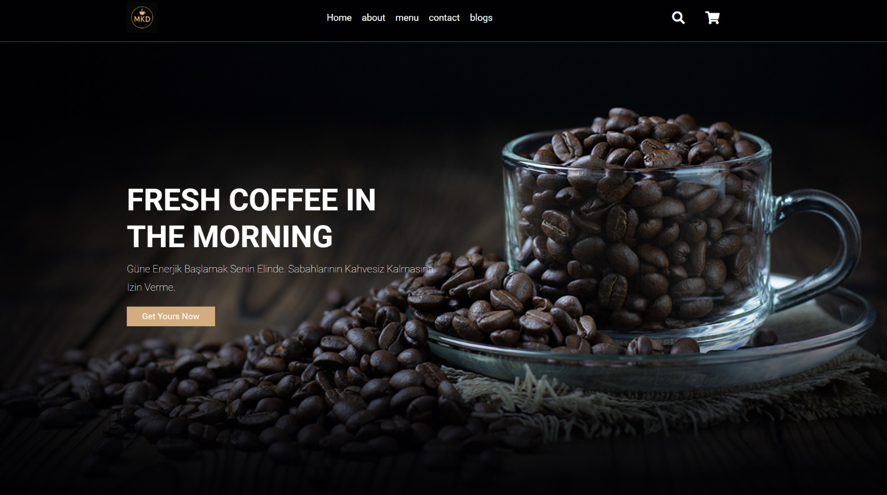
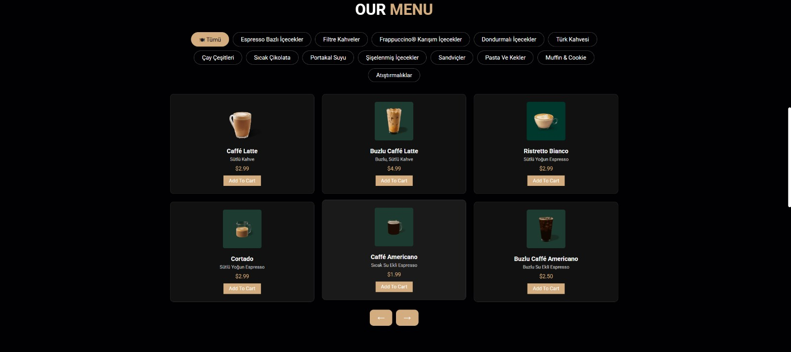
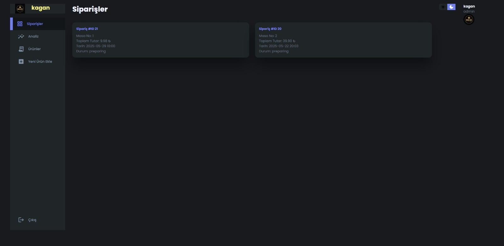
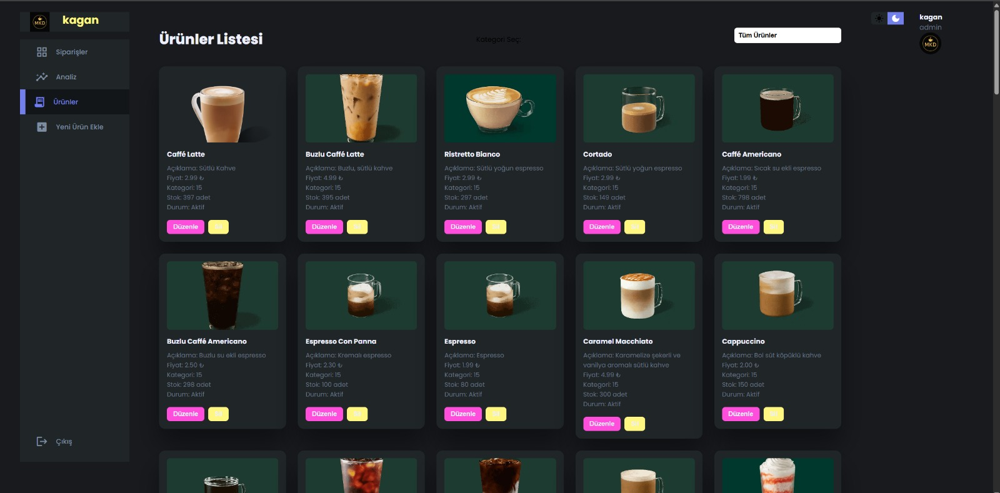

# Cafe Management System (Contactless Order Automation)

A **web-based cafe management system** built using Node.js, Express.js, and MySQL.  
This project provides a **contactless ordering experience** for customers and an **admin panel** for cafe managers to handle products, orders, and sales analytics.

---

## 🚀 Features

### 🧾 Customer Side
- Browse the menu and add products to the cart
- Select a table and confirm the order via **email verification**
- Receive an automatic **order summary email**
- No app or QR code required — fully web-based access

### ⚙️ Admin Panel
- Manage products, categories, and stock
- View and update order statuses (“Preparing”, “Served”, “Cancelled”)
- Visual **sales analytics** with daily and monthly reports (Chart.js)
- Responsive dark/light theme UI


---

## 🧠 Technologies Used
| Layer | Technology |
|--------|-------------|
| Backend | Node.js, Express.js |
| Frontend | Pug, Vanilla JavaScript, CSS |
| Database | MySQL |
| Libraries | Nodemailer, Chart.js |

---

## 🗃️ Database
Database schema is available in [`database/schema.sql`](./database/schema.sql).  
Includes:
- Products, Categories, Orders, Order_Items, Order_Logs, Tables

---

## 🔐 Security
- Email verification to confirm orders  
- Transaction-based database operations  
- Environment variables stored securely in `.env` (not uploaded)

---

## 🧭 How to Run

```bash
npm install
cp .env.example .env   # Fill in your DB credentials
npm start


## 📸 Screenshots

### 🏠 Customer Home Page


### ☕ Product Menu


### 🧾 Admin – Orders Panel


### 🛠 Admin – Product Management


---

## 🔑 Admin Panel Access

To access the admin panel, navigate to:

**URL:** `http://localhost:8080/admin`  
**Username:** `admin`  
**Password:** `1234`

After logging in, you can:
- Manage products and categories  
- View and update customer orders  
- Analyze sales data on the dashboard
